# A DevSecOps pipeline, built over PyGoat

[](https://github.com/acaacx/devsec-pipeline/actions/workflows/ci.yml)

> **The pipeline is the work here; the application is a fixture.** The app is
> [PyGoat](https://github.com/adeyosemanputra/pygoat) — a deliberately
> vulnerable Django app, MIT-licensed — vendored by way of
> [nanuchi/devsecops-crash-course-pygoat](https://github.com/nanuchi/devsecops-crash-course-pygoat).
> **No application code is modified here.** Nothing under `pygoat/`,
> `chatbot/`, `Solutions/` or `introduction/` has been touched, and the upstream
> README is preserved [below](#upstream-pygoat-documentation). See
> [Provenance and licence](#provenance-and-licence).
>
> What this repository adds is everything *around* the application: a five-stage
> security pipeline, a policy gate, hardened deployment manifests, and the
> documentation for all of it.

The interesting problem here is not "run some scanners". It is that **the
application is supposed to be vulnerable.** A pipeline that fails on every
critical finding would be red forever and switched off within a week. So the
gate blocks on *novelty*, not on severity alone: 2904 findings are accepted in a
committed baseline with a written justification each, and the build fails only on
findings that are not.

## The pipeline

| | Stage | Tools |
| --- | --- | --- |
| 1 | **Code** | Gitleaks · Bandit · Semgrep |
| 2 | **Dependencies** | pip-audit · Trivy `fs` |
| 3 | **Build and package** | Hadolint · Trivy `image` · Docker Scout · Syft SBOM · Cosign |
| 4 | **Provision** | Checkov · Trivy `config` · Conftest/OPA · Terraform |
| 5 | **Deploy and DAST** | hardened Compose deployment · OWASP ZAP |
| → | **Security gate** | `.security/gate.py` against `.security/baseline/` |
| → | **Evidence** | 7 SARIF categories to code scanning · SBOM · optional DefectDojo |

Roughly six minutes end to end on GitHub-hosted runners. Full detail, including
why there are two image scanners and three IaC scanners, is in
**[docs/PIPELINE.md](docs/PIPELINE.md)**.

A few properties that are easy to get wrong and are worth calling out:

* **Scanners never fail their own job on findings** — only on scanner *errors*.
  One place decides whether findings are acceptable, and it is the gate.
* **The gate fails closed.** No reports is a failure, not a pass. Partial
  coverage is a failure too: it reads `toJSON(needs)` and refuses to go green if
  any stage did not complete.
* **Fingerprints are location-independent.** Moving a function does not
  invalidate its acceptance — and, after three separate bugs of this shape,
  nothing environment- or run-specific is allowed into a fingerprint.
* **Stage 5 tests the exact bytes Stage 3 built**, handed over as an artifact,
  because Docker builds are not bit-reproducible and scanning a rebuild means
  scanning something that was never shipped.
* **Stage 5 is also the only test `deploy/` has.** PyGoat runs under the same
  constraints as the Kubernetes manifest — read-only root filesystem, UID 10001,
  no capabilities — so a hardening change that breaks the app fails on a pull
  request rather than in a cluster.
* **Everything is pinned by digest or commit SHA**, including `actions/*`.
  Scanners run as digest-pinned containers in `run:` steps, not as third-party
  actions, so CI and `make scan` are one code path.

## Quick start

Docker and Python 3 are the only prerequisites — nothing is installed on the
host, and every target runs the same digest-pinned container as CI with the same
flags.

```bash
make                 # list every target
make scan            # every scanner, then the gate
make gate            # re-evaluate the reports already in reports/
make lint            # actionlint + yamllint
make check-pins      # the eleven scanner digests match ci.yml
make policy-test     # the 34 Rego unit tests for policy/
make dast            # deploy hardened, ZAP baseline, tear down
```

Triage what came out, in a local DefectDojo:

```bash
make defectdojo-up        # first run migrates the database, ~2 min
make defectdojo-import
make defectdojo-down
```

## The gate, in one screen

```
$ python3 .security/gate.py gate --reports reports

✅ PASS — 0 non-baselined blocking finding(s), baseline holds 2904 accepted finding(s).

| Scanner      | Total | Baselined | New | New blocking | Blocks on                             |
| ------------ | ----: | --------: | --: | -----------: | ------------------------------------- |
| bandit       |    11 |        11 |   0 |            0 | CRITICAL, HIGH                        |
| gitleaks     |    10 |        10 |   0 |            0 | CRITICAL, HIGH, MEDIUM, LOW, UNKNOWN  |
| pip-audit    |   108 |       108 |   0 |            0 | CRITICAL, HIGH, MEDIUM, LOW, UNKNOWN  |
| semgrep      |    31 |        31 |   0 |            0 | CRITICAL, HIGH                        |
| trivy-config |     1 |         1 |   0 |            0 | CRITICAL, HIGH, MEDIUM, LOW, UNKNOWN  |
| trivy-fs     |    80 |        80 |   0 |            0 | CRITICAL, HIGH                        |
| trivy-image  |  2671 |      2671 |   0 |            0 | CRITICAL, HIGH                        |
| zap          |    16 |        16 |   0 |            0 | CRITICAL, HIGH                        |
```

That is a local run on arm64. CI sees `trivy-image` 2675 — an amd64 runner has
four packages (`libmpx2`, `libquadmath0`) that do not exist on arm64, which is
why that one scanner is baselined from CI artifacts rather than from a laptop.
Gitleaks shows 10 here and 0 in CI, because a pull request run scans only the
PR's own commits; the full history is walked nightly. `checkov`, `conftest` and
`hadolint` have no row because they report nothing — the intended steady state
for the three scanners aimed at files this repository owns. `pip-audit` totals
108 against 80 baseline entries because it reports one advisory once per matching
dependency path; the fingerprints, not the rows, are what the gate compares.

Per-scanner thresholds are not decoration. `pip-audit` and Checkov community
edition emit **no severity at all**, so severity filtering would silently drop
every finding — for those, any new finding blocks. Gitleaks blocks on everything
because a newly committed secret is never acceptable. The reasoning for each
override is in [`.security/policy.json`](.security/policy.json) next to the
value.

Accepting a finding requires a justification, and accepting a finding in the
*pipeline's own* code (`deploy/`, `policy/`, `.security/`) additionally requires a
compensating control and an expiry date. There are currently two such exceptions,
both expiring 2026-10-31. See **[`.security/POLICY.md`](.security/POLICY.md)**.

## Layout

```
.github/workflows/ci.yml       the pipeline
.github/workflows/nightly.yml  full-history secret scan + unfiltered image scan
.security/gate.py              normalizer, baseline manager, policy gate
.security/policy.json          thresholds - what CI reads
.security/POLICY.md            the same policy, explained and justified
.security/baseline/            accepted findings, one file per scanner
.security/defectdojo.py        push normalized findings to DefectDojo
policy/kubernetes.rego         the controls this repo will not ship without
policy/kubernetes_test.rego    34 unit tests for that policy
deploy/k8s/                    hardened manifests (kubeconform-validated)
deploy/overlay/                the settings overlay both k8s and DAST use
deploy/terraform/              ECR module - validate and plan only, never apply
deploy/compose/                the DAST deployment, and a local DefectDojo
diagrams/                      the pipeline diagram (mermaid source + renders)
Makefile                       the same containers and flags CI runs
```



## Documentation

* **[docs/PIPELINE.md](docs/PIPELINE.md)** — every stage, what it scans, and why
* **[docs/THREAT-MODEL.md](docs/THREAT-MODEL.md)** — STRIDE over the pipeline
  itself, and the accepted risks in one table
* **[docs/BRANCH-PROTECTION.md](docs/BRANCH-PROTECTION.md)** — what `main` must
  require, and the trap of requiring a check that does not always run
* **[.security/POLICY.md](.security/POLICY.md)** — the baseline mechanism,
  severity thresholds, and how to request an exception

## Known gaps

Stated here rather than left to be discovered:

* **Publishing is only ever exercised on `main`.** The GHCR push, the Cosign
  keyless signature and the SBOM attestation are gated to `push` on `main`, so no
  pull request run can reach them — by design, because a pull request must not be
  able to put a signed artefact in a registry. The path is verified end to end
  (push → sign → attest → `cosign verify`, all in-job), but a change to it is
  proven only after it lands.
* **The committed image digest reads one build behind.** `deploy/k8s/30-deployment.yaml`
  pins a specific published digest; every later `main` build publishes a newer
  one. That is intended — a deploy pipeline substitutes the digest it promotes,
  and re-pinning per release is a release process, not a repository file.
* **No cluster.** The Kubernetes manifests are schema-validated with
  `kubeconform -strict` against 1.31 and policy-tested with Conftest, and Stage 5
  exercises the runtime constraints in Docker. Scheduling, probe behaviour,
  `fsGroup` ownership and NetworkPolicy enforcement are unexercised — the last
  also needs a CNI that enforces it.
* **Four `introduction/` endpoints are deliberately broken.** They write
  executable Python into the image at runtime, which the read-only root
  filesystem now refuses. That is the control working; it is recorded as a
  trade-off rather than worked around.

## Provenance and licence

This repository is **not** a GitHub fork — it is a standalone repository that
vendors PyGoat as a test fixture. The application source under `pygoat/`,
`chatbot/`, `Solutions/`, `introduction/`, and the root-level `manage.py`,
`setup.py`, `PyGoatBot.py`, `installer.sh`, `uninstaller.*`, `gh-md-toc`,
`Procfile`, `runtime.txt`, `requirements.txt` and `docker-compose.yml` come from
[adeyosemanputra/pygoat](https://github.com/adeyosemanputra/pygoat) (MIT), taken
via [nanuchi/devsecops-crash-course-pygoat](https://github.com/nanuchi/devsecops-crash-course-pygoat).
Upstream's MIT licence and copyright are reproduced in [LICENSE](LICENSE), which
covers that code and the pipeline added around it alike. [NOTICE](NOTICE) states
which paths came from where.

The upstream `.github/workflows/main.yml` was **replaced**, not extended. Its
contributor list is preserved [below](#contributors-).

Because the app is a vulnerability teaching fixture, it must not be deployed
anywhere reachable. `deploy/` exists to be scanned and policy-tested, and Stage 5
brings the app up only on a private Docker network for the duration of a ZAP
scan.

---

# Upstream PyGoat documentation

Everything below is the upstream project's README, unchanged.

<!-- ALL-CONTRIBUTORS-BADGE:START - Do not remove or modify this section -->
[](#contributors-)
<!-- ALL-CONTRIBUTORS-BADGE:END -->

intentionally vuln web Application Security in django.
our roadmap build intentionally vuln web Application in django. The Vulnerability can based on OWASP top ten
<br>

Table of Contents
=================

* [pygoat](#pygoat)
   * [Installation](#installation)
      * [From Sources](#from-sources)
      * [Docker Container](#docker-container)
      * [Installation Video](#installation-video)
   * [Uninstallation](#uninstallation)
   * [Solutions](/Solutions/solution.md)
   * [For Developers](/docs/dev_guide.md)

## Installation

### From Sources

To setup the project on your local machine:
<br>

First, Clone the repository using GitHub website or git in Terminal
```
  git clone https://github.com/adeyosemanputra/pygoat.git
  ### To Download a specific branch
  git clone -b <branch_name> https://github.com/adeyosemanputra/pygoat.git
```

#### Method 1

1. Install all app and python requirements using installer file - `bash installer.sh`
2. Apply the migrations `python3 manage.py migrate`.<br>
3. Finally, run the development server `python3 manage.py runserver`.<br>
4. The project will be available at <http://127.0.0.1:8000> 

#### Method 2

1. Install python3 requirements `pip install -r requirements.txt`.<br> 
2. Apply the migrations `python3 manage.py migrate`.<br>
3. Finally, run the development server `python3 manage.py runserver`.<br>
4. The project will be available at <http://127.0.0.1:8000> 

#### Method 3

1. Install all app and python requirements using `setup.py` file - `pip3 install .`
2. Apply the migrations `python3 manage.py migrate`.<br>
3. Finally, run the development server `python3 manage.py runserver`.<br>
4. The project will be available at <http://127.0.0.1:8000> 

### Docker Container
1. Install [Docker](https://www.docker.com)
2. Run `docker pull pygoat/pygoat` or `docker pull pygoat/pygoat:latest`
3. Run `docker run --rm -p 8000:8000 pygoat/pygoat:latest`
4. Browse to <http://127.0.0.1:8000> 
5. Remove existing image using `docker image rm pygoat/pygoat` and pull again incase of any error

### From Docker-Compose 
1. Install [Docker](https://www.docker.com)
2. Run `docker-compose up` or `docker-compose up -d`

### Build Docker Image and Run
1. Clone the repository  &ensp; `git clone https://github.com/adeyosemanputra/pygoat.git` 
2. Build the docker image from Dockerfile using &ensp; `docker build -f Dockerfile -t pygoat .`
3. Run the docker image &ensp;`docker run --rm -p 8000:8000 pygoat:latest`
4. Browse to <http://127.0.0.1:8000> or <http://0.0.0.0:8000> 

### Installation video 

1. From Source using `installer.sh`
 - [Installing PyGoat from Source](https://www.youtube.com/watch?v=7bYBJXG3FRQ)
2. Without using `installer.sh`
 - [](http://www.youtube.com/watch?v=rfzQiMeiwso "Installation Pygoat")

## Uninstallation

### On Debian/Ubuntu Based Systems
- On Debian/Ubuntu based systems, you can use the `uninstaller.sh` script to uninstall `pygoat` along with all it's dependencies.
- To uninstall `pygoat`, simply run:
```bash
$ bash ./uninstaller.sh
```

### On Other Systems
- On other systems, you can use the `uninstaller.py` script to uninstall `pygoat` along with all it's dependencies
- To uninstall `pygoat`, simply run:
```bash
$ python3 uninstaller.py
```

## Solutions 
<a href="/Solutions/solution.md">Solutions to all challenges</a>

## Contributors ✨

Thanks goes to these wonderful people ([emoji key](https://allcontributors.org/docs/en/emoji-key)):

<!-- ALL-CONTRIBUTORS-LIST:START - Do not remove or modify this section -->
<!-- prettier-ignore-start -->
<!-- markdownlint-disable -->
<table>
  <tr>
    <td align="center"><a href="https://github.com/pwned-17"><br /><sub><b>pwned-17</b></sub></a><br /><a href="https://github.com/adeyosemanputra/pygoat/commits?author=pwned-17" title="Code">💻</a></td>
    <td align="center"><a href="https://github.com/prince-7"><br /><sub><b>Aman Singh</b></sub></a><br /><a href="https://github.com/adeyosemanputra/pygoat/commits?author=prince-7" title="Code">💻</a></td>
    <td align="center"><a href="https://github.com/adeyosemanputra"><br /><sub><b>adeyosemanputra</b></sub></a><br /><a href="https://github.com/adeyosemanputra/pygoat/commits?author=adeyosemanputra" title="Code">💻</a> <a href="https://github.com/adeyosemanputra/pygoat/commits?author=adeyosemanputra" title="Documentation">📖</a></td>
    <td align="center"><a href="https://github.com/gaurav618618"><br /><sub><b>gaurav618618</b></sub></a><br /><a href="https://github.com/adeyosemanputra/pygoat/commits?author=gaurav618618" title="Code">💻</a> <a href="https://github.com/adeyosemanputra/pygoat/commits?author=gaurav618618" title="Documentation">📖</a></td>
    <td align="center"><a href="https://github.com/kUSHAL0601"><br /><sub><b>MajAK</b></sub></a><br /><a href="https://github.com/adeyosemanputra/pygoat/commits?author=kUSHAL0601" title="Code">💻</a></td>
    <td align="center"><a href="https://github.com/JustinDPerkins"><br /><sub><b>JustinPerkins</b></sub></a><br /><a href="https://github.com/adeyosemanputra/pygoat/commits?author=JustinDPerkins" title="Code">💻</a></td>
    <td align="center"><a href="https://github.com/Hkakashi"><br /><sub><b>Liu Peng</b></sub></a><br /><a href="https://github.com/adeyosemanputra/pygoat/commits?author=Hkakashi" title="Code">💻</a></td>
  </tr>
  <tr>
    <td align="center"><a href="https://github.com/RupakBiswas-2304"><br /><sub><b>Metaphor</b></sub></a><br /><a href="https://github.com/adeyosemanputra/pygoat/commits?author=RupakBiswas-2304" title="Code">💻</a></td>
    <td align="center"><a href="https://whokilleddb.github.io"><br /><sub><b>whokilleddb</b></sub></a><br /><a href="https://github.com/adeyosemanputra/pygoat/commits?author=whokilleddb" title="Code">💻</a></td>
  </tr>
</table>

<!-- markdownlint-restore -->
<!-- prettier-ignore-end -->

<!-- ALL-CONTRIBUTORS-LIST:END -->

This project follows the [all-contributors](https://github.com/all-contributors/all-contributors) specification. Contributions of any kind welcome!
