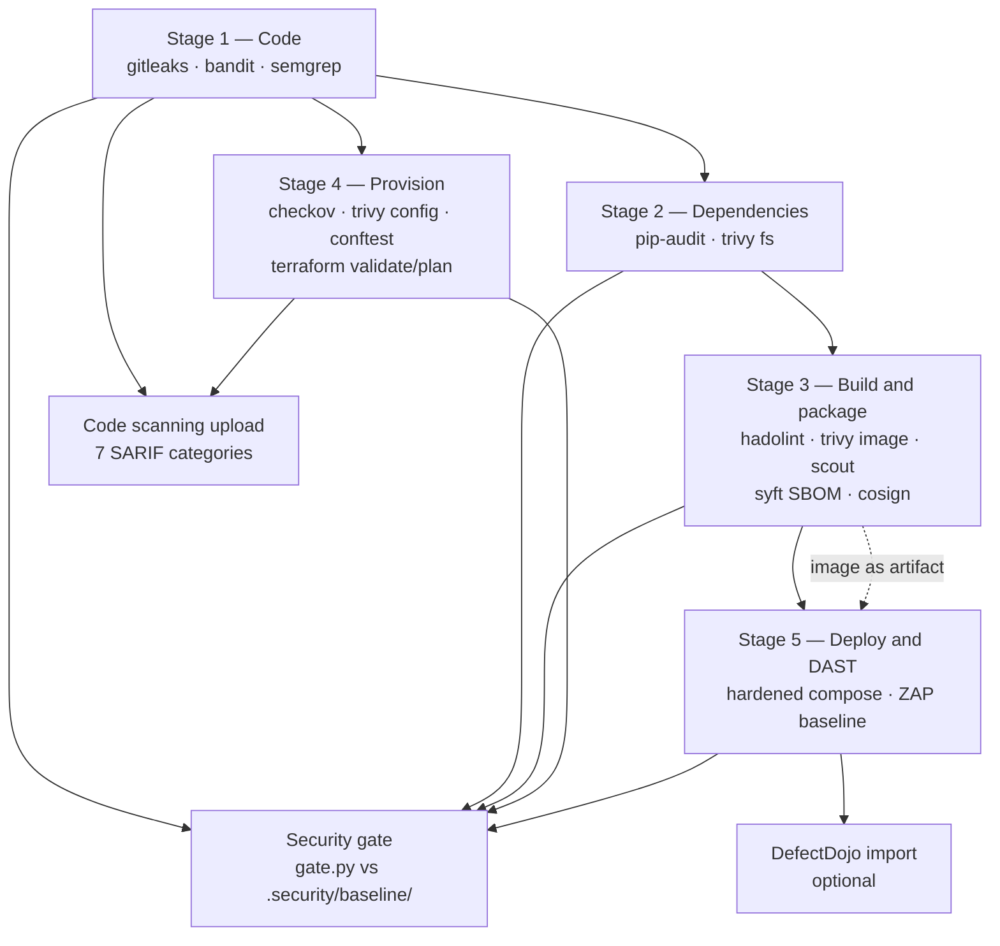

# The pipeline

What runs, in what order, and why each thing is there. The workflow itself is
[`.github/workflows/ci.yml`](../.github/workflows/ci.yml); it is heavily
commented, and this document is the map rather than a second copy of it.

The application under test is [PyGoat](https://github.com/adeyosemanputra/pygoat),
which is deliberately vulnerable. That single fact drives most of the design
decisions below: a pipeline that simply fails on critical findings would be red
forever and therefore ignored.

---

## Shape



Stage 4 does not wait on the build: infrastructure code has nothing to do with
the image, and making it wait would add three minutes to every run for nothing.

Stage 5 receives the *exact image* Stage 3 built, as an artifact, rather than
rebuilding it. Docker builds are not bit-reproducible, so a second `docker build`
in another job produces different bytes — and scanning something that is never
shipped is the same class of mistake as signing a mutable tag. The compose file
sets `pull_policy: never` so a missing image fails loudly instead of being
silently substituted from GHCR, where the same tag also exists.

## What each stage is for

| Stage | Tool | Kind | What it looks at |
| --- | --- | --- | --- |
| 1 | Gitleaks | secrets | PR diff (full history nightly) |
| 1 | Bandit | Python SAST | `.py` under the repo |
| 1 | Semgrep | pattern SAST | `p/python`, `p/django`, `p/owasp-top-ten` |
| 2 | pip-audit | dependency advisories | `requirements.txt`, resolved |
| 2 | Trivy `fs` | dependencies, licences, secrets | working tree |
| 3 | Hadolint | Dockerfile lint | `Dockerfile` |
| 3 | Trivy `image` | OS + language packages, secrets | the built image |
| 3 | Docker Scout | CVEs, second opinion | the built image (optional) |
| 3 | Syft | SBOM (CycloneDX + SPDX) | the built image |
| 3 | Cosign | keyless signature + SBOM attestation | the pushed digest |
| 4 | Checkov | IaC misconfiguration | `deploy/` (k8s + terraform) |
| 4 | Trivy `config` | IaC misconfiguration | `deploy/` |
| 4 | Conftest | **our** policy, `policy/kubernetes.rego` | `deploy/k8s/` |
| 4 | Terraform | `fmt`, `validate`, `plan` | `deploy/terraform/` |
| 5 | ZAP | DAST, baseline scan | PyGoat over HTTP |

Two image scanners and two IaC scanners is deliberate, not duplication:

* **Trivy and Docker Scout** resolve CVEs against different advisory databases.
  Scout needs a Docker Hub account, which `GITHUB_TOKEN` cannot provide, so it is
  optional and **Trivy is the mandatory image scanner**. Without the secrets the
  step prints a notice and the pipeline carries on.
* **Checkov, Trivy config and Conftest** are not three scanners with the same
  job. The first two bring large third-party rule sets — useful, generic, and
  advisory. Conftest enforces `policy/kubernetes.rego`: the handful of controls
  this repository will not ship without, written here, with
  [34 Rego unit tests](../policy/kubernetes_test.rego) that run *before* the
  policy is allowed to judge anything.

## Findings never fail their own job

Every scanner step exits 0 when it finds things and non-zero only when the
scanner itself failed — an empty report, a crash, an exit code above the range
the tool documents for findings. Each job then normalizes its raw reports into
`normalized-<stage>.json` and uploads that.

One place decides whether findings are acceptable: the **security gate**.

That split matters for gitleaks. Stage 1 produces two reports — a `--redact`ed
SARIF that is safe to publish, and an unredacted JSON that never leaves the
runner. Only fingerprints computed from the unredacted file cross the job
boundary, inside `normalized-code.json`. The artifact upload lists explicit
paths rather than the directory, so the plaintext report cannot leak by
accident.

## The security gate

```
security-gate  needs: [code-scan, dependency-scan, build-and-package,
                       provision-scan, dast]
```

It downloads every `findings-*` artifact into one directory and runs
`python3 .security/gate.py gate`. Full mechanics are in
[`.security/POLICY.md`](../.security/POLICY.md); in short:

* each finding gets a **location-independent fingerprint**, so moving a function
  does not invalidate its acceptance;
* fingerprints present in `.security/baseline/` are accepted silently;
* anything else at or above that scanner's blocking severity **fails the build**;
* the verdict, a per-scanner table and the blocking findings are written to
  `$GITHUB_STEP_SUMMARY`, and each blocking finding also gets a `::error`
  annotation on the diff.

Two properties are worth knowing because they are easy to get wrong:

**It fails closed.** No reports at all is a failure, not a pass. A pipeline that
passes vacuously when the scanners silently stopped running is worse than no
pipeline.

**It refuses to pass on partial coverage.** The job runs under `if: always()`, so
a stage that failed still gets a verdict instead of a skipped gate. It reads
`toJSON(needs)` and fails when any stage did not succeed — but *records* that
first and still prints the table, because that table is how you see which
scanner is missing.

## Publishing evidence

**Code scanning.** Seven SARIF files are uploaded, each with a distinct
`category`: `bandit`, `semgrep`, `gitleaks`, `trivy-fs`, `hadolint`,
`trivy-image`, `trivy-config` (plus `docker-scout` when configured). Code
scanning keys a tool's alert set by `(tool, category)`, so two uploads sharing
one category make the second look like the first with everything fixed —
silently closing real alerts. Trivy runs three times here and would collide.

This job is separate from the gate on purpose: publishing evidence is not
gating. A failing gate must not suppress the alerts that explain it, and a
failed upload must not turn a clean gate red.

ZAP is absent because `zap-baseline.py` emits JSON (`-J`) and HTML (`-r`) only.
Its findings are gated like everything else and kept as run artifacts.

**DefectDojo.** Optional, and off unless `DEFECTDOJO_URL` and
`DEFECTDOJO_TOKEN` are configured. See [triage](#triage) below.

**SBOM.** CycloneDX and SPDX, kept for 90 days. Both formats because
vulnerability tooling consumes CycloneDX and licence/procurement tooling expects
SPDX. This is what you reach for when a new CVE lands and the question is "are we
affected?".

## Publish, sign, attest

Gated to `github.event_name == 'push' && github.ref == 'refs/heads/main'`. A pull
request must never be able to put a signed artefact in a registry, and a fork's
`GITHUB_TOKEN` is read-only anyway.

* the image is tagged with the **commit SHA, never `latest`**, so every artefact
  traces to one commit — and `policy/kubernetes.rego`'s ban on mutable tags is
  not something the pipeline itself violates;
* signing and attestation happen **by digest**, not by tag: a tag is mutable, so
  signing one leaves a window where the signature covers different bytes;
* Cosign signs **keylessly**, with the identity proven by the OIDC token GitHub
  mints for the job. No private key exists to be stolen, which is why
  `id-token: write` is scoped to that one job;
* the signature is verified immediately afterwards, because a signing step that
  merely exits 0 has proven nothing.

## Stage 5 is also the only test `deploy/` has

ZAP is the visible output, but the more useful property is that Stage 5 brings
PyGoat up under **the same constraints as `deploy/k8s/30-deployment.yaml`** —
read-only root filesystem, UID 10001, all capabilities dropped, and the same
settings overlay the ConfigMap is rendered from. A hardening change that stops
the application serving traffic fails here, on a pull request, instead of in a
cluster.

It has already earned that: Compose mounts a tmpfs outside `/tmp` as root-owned
`0755` and has no `fsGroup`, so gunicorn died with
`Permission denied: '/home/pygoat/.gunicorn'` on every start until the mount
gained `mode: 01777`.

The settings overlay is shared rather than duplicated. Kubernetes cannot mount a
file out of the repository, so `deploy/k8s/20-configmap-settings.yaml` is
**generated** from `deploy/overlay/pygoat_deploy_settings.py`, and a Stage 4 step
(`make check-overlay`) fails on drift. Two copies of security-relevant
configuration drift, and the drift would be silent — DAST would keep passing
against settings nobody deploys.

### ZAP fingerprints, and the one alert that flaps

`parse_zap` fingerprints **plugin ID + alertRef only**. URLs are kept in `meta`
and excluded from the fingerprint: the crawl is concurrent and the passive-scan
queue drains asynchronously, so which URLs an alert attaches to varies run to
run.

Alert-set *membership* is deliberately left flapping. `10049-3` ("Storable and
Cacheable Content") appears in roughly two runs out of three; it is reported as a
stale baseline entry, which is informational and blocks nothing. An intermittent
alert is a real alert, and hiding it would be the wrong fix.

`.security/zap/rules.tsv` sets **nothing** to FAIL. ZAP does not decide whether
the build passes; `gate.py` does. `IGNORE` is reserved for artefacts of the
harness — anything about PyGoat goes in the baseline, where the decision is
visible and justified.

## Triage

The gate answers "may this merge?". It does not answer "what should we fix
first?". [`.security/defectdojo.py`](../.security/defectdojo.py) pushes the
normalized findings into DefectDojo, and
[`deploy/compose/docker-compose.defectdojo.yml`](../deploy/compose/docker-compose.defectdojo.yml)
brings up a local instance to receive them:

```bash
make defectdojo-up       # first run migrates the database, ~2 min
make scan                # or just `make gate` if reports/ is already populated
make defectdojo-import
make defectdojo-down     # keeps the database; -destroy removes it
```

The import goes through gate.py's normalized findings rather than handing
DefectDojo eleven raw scanner reports. One code path instead of eleven native
parser names to keep matching a moving upstream — a `scan_type` DefectDojo no
longer recognises imports zero findings and still returns `201`. It also means
the gate's fingerprint becomes `unique_id_from_tool`, so both systems agree on
what "the same finding" is, and the baseline maps onto DefectDojo's own
`risk_accepted` state: accepted-with-a-justification and new-and-unreviewed are
distinguishable in the UI, which is the distinction this repository is about.

## Nightly

[`.github/workflows/nightly.yml`](../.github/workflows/nightly.yml) carries what
is too slow or too noisy for a per-PR run:

* **full-history secret scan.** A secret that was committed and later deleted is
  still leaked, and the PR scan only sees the diff.
* **deep image scan.** No severity filter, unfixed vulnerabilities included, so
  baseline drift is visible before it becomes a surprise.

## Running it locally

Every `make` target runs the *same digest-pinned container as CI with the same
flags*, so a clean `make scan` means a clean pipeline. Nothing is installed on
the host; Docker and Python 3 are the only prerequisites.

```bash
make lint            # actionlint + yamllint
make check-pins      # the eleven Makefile digests match ci.yml
make check-overlay   # the ConfigMap still matches deploy/overlay/
make policy-test     # conftest verify - the Rego unit tests
make scan-iac        # checkov + trivy config + conftest + terraform
make dast            # deploy hardened, ZAP baseline, tear down
make scan            # every scanner, then the gate
```

Two local gotchas, both real:

* **`make dast-up` alone fails after a commit.** `IMAGE_LOCAL` derives from
  `HEAD`, so run `make build` (or `make dast`, which does) first. The guard
  prints exactly this.
* **`trivy-image` cannot be baselined from an arm64 laptop.** The gate runs on
  amd64 and sees packages such as `libmpx2` and `libquadmath0` that do not exist
  on arm64. Local findings are a strict subset, so the amd64 baseline is correct
  for both — but a rebaseline must come from CI artifacts. `.security/POLICY.md`
  §4 has the procedure.

## Conventions the pipeline holds itself to

1. **Every action is pinned to a full commit SHA**, with the version in a
   trailing comment — including `actions/*`. Semgrep's
   `github-actions-mutable-action-tag` rule flags mutable tags, and baselining
   our own supply-chain finding was rejected as dishonest.
2. **Scanners run as digest-pinned containers** in `run:` steps, not as
   third-party actions. One code path serves CI and `make scan`, and the attack
   surface is a digest instead of a marketplace action's whole dependency tree.
   Docker Scout is the only third-party action left. `make check-pins` enforces
   all eleven pins against `ci.yml`.
3. **Findings in the pipeline itself get fixed, not baselined**
   (`.security/POLICY.md` §3(b)). `deploy/`, `policy/` and `.security/` count as
   the pipeline. Genuine exceptions need a compensating control and an expiry
   date.
4. **Least privilege.** The workflow grants `contents: read`; `packages: write`
   and `id-token: write` exist only on the build job, `security-events: write`
   only on the upload job.
5. **Never commit reports, secrets or tokens.** `reports/` is gitignored in full
   (including `reports/.dast/` and the generated
   `reports/.defectdojo.env`), and `.security/baseline/` is explicitly
   un-ignored.
6. **App code is not modified.** Nothing under `pygoat/`, `chatbot/`,
   `Solutions/` or `introduction/` is touched; problems are fixed at the
   deployment boundary, which is what `deploy/overlay/` is for.
